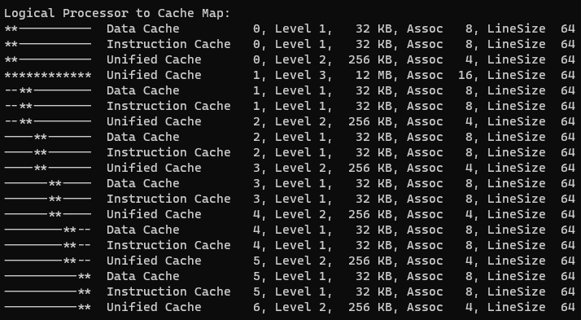
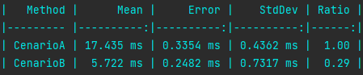

+++
author = "Thiago Borba"
title = "Cachelines e False Sharing"
slug = "cache-line-false-sharing"
date = "2021-07-15"
description = "False sharing é um problema que ocorre quando threads físicas paralelas acessam uma mesma cacheline que possui dados pequenos e que sofrem alterações constantes. False sharing é um problema universal em processadores onde as linhas de cache são compartilhadas com mais de uma thread."
tags = [
"Performance",
"Programação Paralela",
]
categories = [
"LowLevel",
]
image = "cacheline.png"
+++

## CPU Cache
Os processadores possuem estratégias de caching para manter as próximas instruções a serem executadas e blocos
de dados a serem manipulados o mais próximo de uma thread, economizando ciclos para buscar dados na memória RAM; busca que no contexto de CPU é extremamente lento.
O cache de CPU é distribuído em níveis, onde L1 é um cache muito pequeno exclusivo para um core e compartilhado com as suas threads e o L2 é um
cache um pouco maior compartilhado por um grupo de core.

### Cacheline
O processador busca dados na memória em blocos e não ‘byte’ a ‘byte’. Esses blocos de dados são chamados de cacheline.
Quando o processador lê um determinado ponto da memória ele busca, a partir desse ponto,
a quantidade de dados equivalentes ao tamanho da cacheline.
Em média uma linha de cache possui 64 ‘bytes’, variando de acordo com a arquitetura do processador. Quanto maior o tamanho do cache
maior é quantidade de linhas, ou seja, menor é quantidade de leituras na memória RAM.

| Processador| Cache L1 | Cache L2 | Cache L3| Lançamento | Preço|
|---|---|---|---|---|---|
|i7-9750H|32K|256K|12M|2019|~USD 395|
|Xeon E5-2620 |384K|1,5M|15M|2012|~USD 410|

> **Tamanho do cache e cacheline**
> 
> Para verificar o tamanho do cache e cacheline em uma máquina com Windows, [utilize o aplicativo Coreinfo da Sysinternal.](https://docs.microsoft.com/en-us/sysinternals/downloads/coreinfo)
> 

### Cache coherence protocol
As CPUs modernas na sua maioria possuem mais de uma thread por core, utilizando técnicas de programação paralela. 
Uma das estratégias é utilizar as micropausas de uma thread física (ex.: buscar dados na memória RAM) para que outra thread
execute alguma operação.

> Tecnologia proprietária
> 
> Cada fornecedor define a sua tecnologia para maximizar o desempenho de um processador.
> - [Intel Hyper-thread](https://www.intel.com.br/content/www/br/pt/gaming/resources/hyper-threading.html)
> - [AMD Simultaneous Multithreading](https://www.amd.com/)

As threads físicas compartilham o cache L1 exclusivo do seu core, assim como o cache L2, que é compartilhado por um grupo de core e outros
níveis de cache possam existir. Por fim, acima dessa estrutura de cache, existe a memória RAM.



Dado o cenário de paralelismo, a CPU deve implementar estratégias de sincronização desses dados para evitar o problema demonstrado na imagem acima.
Essa estratégia é chamada de **Cache coherence protocol**. Esse protocolo é responsável por manter a coerência e integridade no cache.



### Otimização de compiladores
Os compiladores modernos além gerarem códigos que utilizam os recursos fornecidos pelas CPUs também implementam estratégias e técnicas
de otimização, com o objetivo de extrair o máximo do hardware. Porém, nem sempre os compiladores conseguem gerar o código mais performático 
por uma série de motivos, que sozinhos são tema de um futuro post.
Dificilmente esses problemas são detectados nos processos de desenvolvimento e/ou qualidade. Não é incomum que eles ocorram somente em 
produção de forma não determinística.

## False sharing
Em algumas situações o código de um programador não consegue ser otimizado pelo compilador, o que introduz problemas
de desempenho ou até mesmo falhas. Uma dessas situações é o **false sharing**. O false sharing ocorre quando o **cache coherence protocol**
entende ser necessário atualizar uma determinada linha de cache, fazendo com que ocorra uma nova leitura do dado na memória RAM. 
_Lembrando que leitura de memória RAM num contexto de CPU é uma operação lenta!_ 

Quando threads físicas fazem **leituras** e **gravações** **frequentes** de um **dado** muito **pequeno** que estão alinhados na memória RAM num cenário de **paralelismo**
essa situação ocorrerá.

Nos exemplos abaixo temos um código cujo objetivo é para cada posição de um array de inteiros incrementar o valor da referência num ‘looping for’ 1.000.000 de vezes.
> Foi utilizado um laptop com um processador i7-9750H para os testes.

### Cenário A - False sharing
 **17,435** segundos para finalizar o processamento.
```csharp
private readonly int[] sharedArray = new int[4];

public void CenarioA()
{
    var task1 = Task.Run(() => Inc(0));
    var task2 = Task.Run(() => Inc(1));
    var task3 = Task.Run(() => Inc(2));
    var task4 = Task.Run(() => Inc(3));

    Task.WaitAll(task1, task2, task3, task4);
}

private void Inc(int position)
{
    for (var i = 0; i < 1_000_000; i++)
        sharedArray[position]++;
}
```

### Cenário B - Otimização de código
**5,72** segundos para finalizar o processamento.
```csharp
private readonly int[] sharedArray = new int[64];

public void CenarioB()
{
    var task1 = Task.Run(() => Inc(0));
    var task2 = Task.Run(() => Inc(16));
    var task3 = Task.Run(() => Inc(32));
    var task4 = Task.Run(() => Inc(48));

    Task.WaitAll(task1, task2, task3, task4);
}

private void Inc(int position)
{
    for (var i = 0; i < 1_000_000; i++)
        sharedArray[position]++;
}
```

### Benchmark Cenários A e B
No benchmark observamos que o Cenário B executou aproximadamente 3x mais rápido que o cenário A.



No CenárioA todas as threads compartilham a mesma cacheline para leitura e gravação. Isso faz o cache coherence protocol 
invalidar diversas vezes a cacheline e consequentemente a CPU deve buscar na memória RAM o valor atualizado.
Já no CenárioB utilizamos uma estratégia onde cada thread utiliza uma cacheline diferente! Para fazer isso é utilizado 
saltos de 16 posições no array de inteiro, ou seja:

|Quantidade de Int32| Tamanho Int32|Tamanho ocupado|
|---|---|---|
|16|4 bytes|16 x 4 bytes = 64 bytes|

Considerando que o processador onde o benchmark é executado possui uma cacheline de 64 ‘bytes’, cada thread utilizará uma 
cacheline diferente.

## Conclusão
Apesar dos compiladores ocultarem parte da complexidade da programação paralela há cenários que precisam da intervenção do programador.
Entender como funciona alocação de memória na sua stack de desenvolvimento assim como conhecer o funcionamento de componentes de hardware
são ferramentas essenciais para a escrita de códigos de alto desempenho e otimizados.

> 👉 Dica ☠️
> 
> Otimização prematura do código traz complexidade sem agregar valor! Evite :)

> 🤯 **Informação**
> 
> False sharing é um problema universal em processadores multithreading que compartilham cache. 
> O exemplo acima funciona em qualquer linguagem :) 