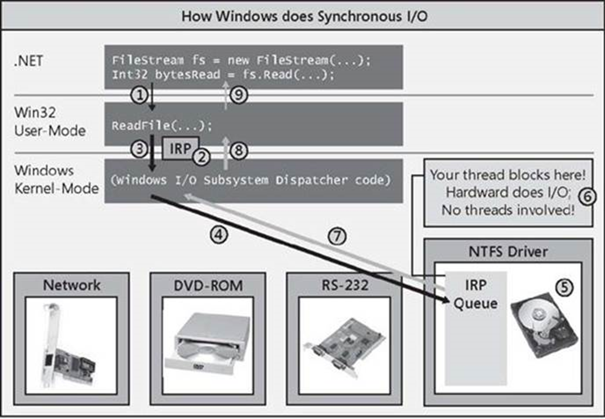
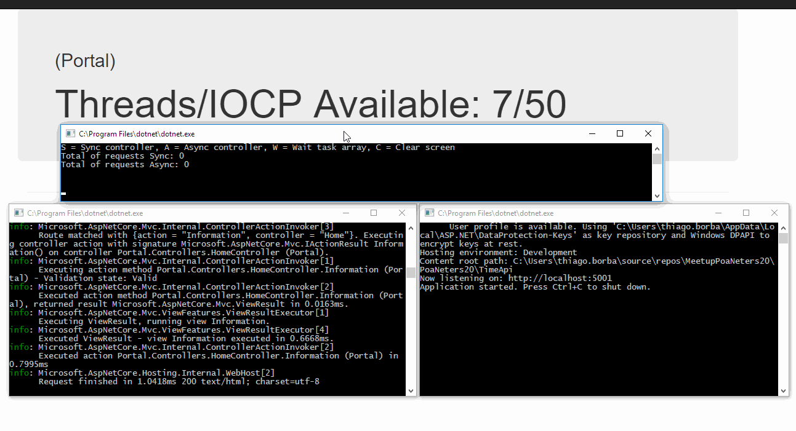
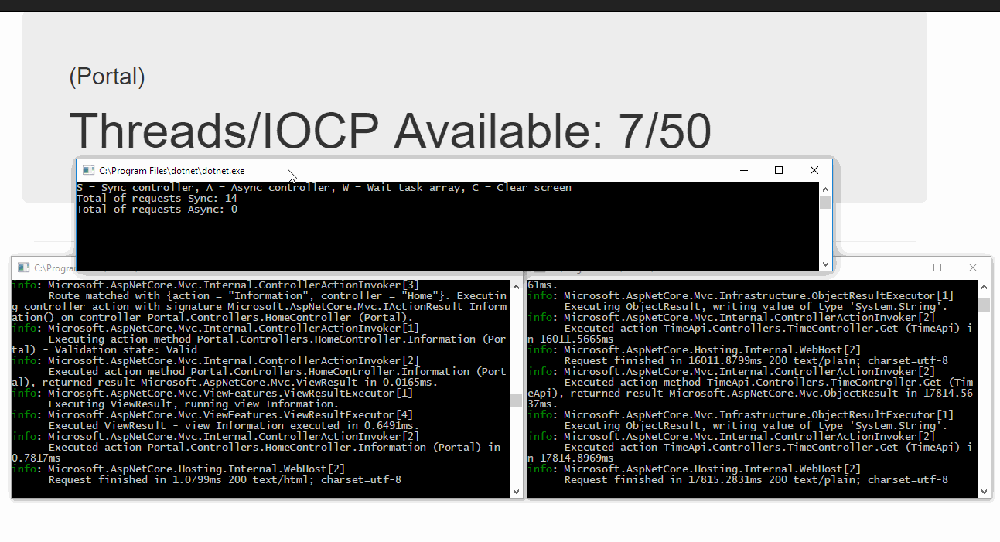

+++
author = "Thiago Borba"
title = "IO Bound - There is no thread <0>"
date = "2019-08-11"
slug = "io-bound-there-is-no-thread"
description = "Desde a sua versão beta, o .NET suportou chamadas assíncronas, inclusive chamadas de IO Bound. Com a evolução do hardware e a chegada de processadores multicores, o .NET evoluiu e trouxe a TPL, que simplificou o uso de trabalhos de IO Bound."
tags = [
    "C#",
    "Performance",
]
categories = [
    "Csharp",
]
image = "featured.jpg"
+++

## O problema

**Quem nunca ouviu alguma dessas frases:**

    "...sua aplicação deve ser assíncrona...",
    "...se está lento muda o método para async...",
    "...todos os métodos da API devem ser assíncronos...",
    "...usa async para tentar resolver o problema de lentidão",
    "Eu li num blog que aplicações modernas em C# devem ser async/await...". 

No final de tudo, encontramos esse tipo de código na aplicação:

```csharp
public static Task DoRequest(string url)
  => Task.Run(async () =>
     {
          await httpClient.GetStringAsync(requestUri: url);
          Console.WriteLine($"{DateTime.Now} - Task completed.");
     });
```

## IO Bound & CPU Bound

Dentro da computação, IO Bound refere-se a cargas de trabalho de IO (disco, redes, dispositivos) e CPU Bound às cargas de trabalho de CPU (algoritmos, cálculos).

## Microsoft Windows e IO Bound

Conceitualmente, toda a carga de trabalho de uma aplicação é executada por uma thread. Essa thread possui uma fatia de tempo (time slice) de uso do processador.

**Agora, se aplicação faz o acesso a um IO, porque deve existir uma thread?**

De fato, não faz sentido. Por esse motivo o Windows, em sua natureza assíncrona, trata esse cenário de IO Bound. Toda chamada para o Windows, mesmo que síncrona, será tratada como assíncrona.
Quando o .NET acessa um recurso de IO, ele cria uma IOCP (IO Completation Port) vinculada ao chamador. O .NET utiliza as IOCP para gerenciar as solicitações de IO realizadas pela aplicação. Na sequencia o .NET faz acesso a API Win32, cria um IRP (IO Request Packet) e adiciona-o na fila do dispositivo.
O IRP faz parte da arquitetura do Windows, e é utilizado para comunicação com dispositivos. Nessa arquitetura, é utilizado uma fila IRP para o dispositivo, que retira o pacote da fila, processa o trabalho e devolve o resultado.

Observe que nesse processo, não há thread envolvida. É puramente IO!



Uma vez que o trabalho é concluído, o dispositivo faz uma chamada de interrupção de sistema e devolve o resultado. Quando isso acontece, a API Win32 irá obter o resultado do trabalho e notificará o .NET através da IOCP criada na requisição. Nesse momento, o .NET irá obter uma thread do ThreadPool e devolverá o resultado para o chamador.

## .NET e IO Bound

Uma vez que entendemos essa arquitetura, fica claro porque as chamadas assíncronas precisam ser **"async all the way"** e principalmente, porque não há threads em IO Bound.

Quando olhamos novamente o código, fica claro porque ele não faz sentido.

```csharp
public static Task DoRequest(string url)
  => Task.Run(async () =>
     {
          await httpClient.GetStringAsync(requestUri: url);
          Console.WriteLine($"{DateTime.Now} - Task completed.");
     });
```

Como essa chamada é síncrona, o httpclient manterá a thread bloqueada até finalizar o request, ou seja, nesse código estamos alocando uma Task e sua estrutura de máquina de estado para aguardar uma thread que sabemos que ficará bloqueada. Neste caso, onde a chamada é síncrona, e há somente métodos assíncronos disponíveis na API, então usamos .Result.

```csharp
public static void DoRequest(string url)
{
    httpClient.GetStringAsync(requestUri: url).Result;
    Console.WriteLine($"{DateTime.Now} - Task completed.");
};
```

Para utilizar chamadas assíncronas em .NET é necessário que:

- Chamada seja "async all the way"
- Lib de acesso ao recurso implemente "async all the way"

Se qualquer uma dessas condições não for atendida, o seu código estará bloqueando uma thread para cargas de trabalho IO Bound.

## Demostração do Impacto do IO Bound

Para materializar a importância do IO Bound na aplicação e o seu impacto, vamos analisar a PoC abaixo.


- TimeApi
  - O TimeApi é uma API Rest em .NET Core que possui um método GET que retorna um DateTime atual. Antes de retornar o DateTime ele uso um delay aleatório de 10s até 20s a fim de simular uma API com problemas de performance.
- Portal
  - O Portal é uma aplicação ASPNET Core que possui 3 actions, sendo a Index (faz uma chamada síncrona para TimeApi), a IndexAsync (faz uma chamada assíncrona para TimeApi) e a Information (retorna a quantidade de threads disponíveis na aplicação). A aplicação Portal possui uma restrição de threads disponíveis, limitada ao número de cores do processador da máquina da demostração (8 cores). Isso é utilizado para simular um servidor com alta carga de trabalho e poucas threads disponíveis.
- Requester
  - O Requester é uma aplicação console em .NET Core que faz chamadas síncronas e assíncronas para o Portal.



Na chamada síncrona, bloqueamos uma thread, que fica aguardando finalizar a carga de trabalho IO.



Já na chamada assíncrona, com o "async all the way", as threads não são bloqueadas. Assim que invocamos o HttpClient, ele segue o fluxo de processamento assíncrono que vimos acima e libera a thread do request para retornar ao Threadpool. Desta forma, mesmo que a TimeApi apresente algum problema de performance, a aplicação Portal fica disponível para receber novos requests.

## Custo da programação Assíncrona
Quando uma aplicação apresenta lentidão, a resposta default, na maioria dos casos é "... precisamos de mais hardware.". De fato, o aumento do hardware minimiza os problemas de performance, mas à um alto custo financeiro. Na demonstração, onde simulamos um ambiente com hardware limitado e/ou carga alta de trabalho e com uma API problemática, observamos que utilizando as chamadas assíncronas corretamente, fomos capazes de atender 305 requisições!
Comparando com o total de requisições síncronas obtidas, que foram 14, significa que a aplicação assíncrona foi 22x mais eficiente no uso do hardware.

Se considerarmos que nesse cenário hipotético, a aplicação deve atender até 305 requests, concluimos que:

- Na versão síncrona precisaríamos de 14 servidores;
- Na versão assíncrona, os 14 servidores da versão síncrona poderiam ser reduzidos para 1 único servidor.

Considerando o custo de um servidor físico de BRL 12.000, concluimos que:

- O custo de infraestrutura para versão síncrona seria de BRL 168.000;
- O custo de infraestrutura para versão assíncrona seria de BRL 12.000.

## Reflexão

Mais do que um software funcional, é necessário que ele seja eficiente e responsável. Devemos conhecer como o Framework que trabalhamos funciona. Devemos aprender a escrever código que aproveite o máximo possível o hardware disponível.

[Os fontes utilizados nesse artigo, estão disponíveis no Github.](https://github.com/thgbrb/ThereIsNoThread)