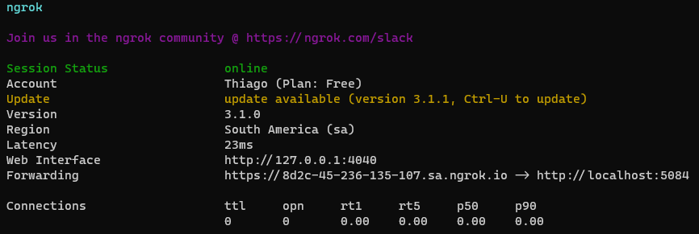
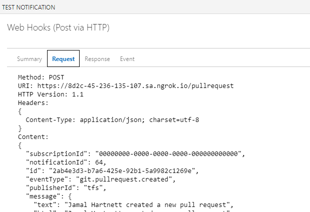
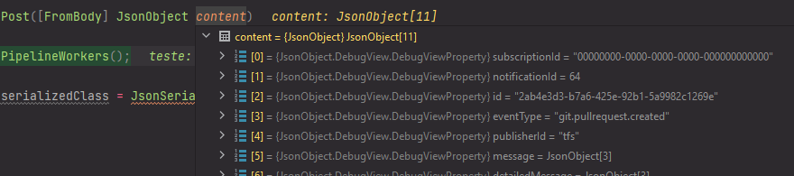

+++
author = "Thiago Borba"
title = "Ingress-as-a-Service - Exposição de serviços locais"
slug = "ngrok-dns-publico-temporario"
date = "2023-01-28"
description = "Durante alguns ciclos e desenvolvimento é necessário que um dado serviço seja exposto para ser consumido na internet. Um típico cenário para isso é o desenvolvimento de webhooks. Em um cenário de webhook talvez seja necessário que um serviço externo sensibilize o endpoint que está sendo desenvolvimento. Entre as soluções mais tradicionais estão a publicação da aplicação em alguma plataforma serverless como por exemplo ECS, Beanstalk ou Hiroku. Esse artigo apresenta uma alternativa rápida, que expõe o seu serviço local."
tags = [
"Dica",
]
categories = [
"infraestrutura",
]
image = "pablo-arroyo-_SEbdtH4ZLM-unsplash.jpg"
+++

A facilidade do uso das clouds permite que em poucos minutos uma aplicação esteja disponível e publicada, porém demanda um esforço para que isso aconteça. Esse esforço envolve normalmente o provisionamento de ambientes e a sua publicação a cada alteração.
Uma alternativa para exposição de serviços é rotear o acesso diretamente para a aplicação local. Essa estratégia elimina a necessidade de publicações para testes e /ou validações. Sem o uso de ferramentas esse processo tende a ser demorado, manual e pouco eficiente.

## Ngrok - Ingress-as-a-Service
O [Ngrok](https://ngrok.com/) é uma ferramenta super esperta que, através da utilização de um agente local, permite redirecionar todo o tráfego de uma DNS temporãrio para uma porta local específica. 
Isso significa, que toda a requisição feita para esse DNS temporário é redirecionada para a porta local do seu dispositivo.


## Webhook
Durante a integração como o webhook do Azure DevOps foi necessário expor uma URL válida para receber os eventos do Azure DevOps. Para agilizar o processo do laboratório inicial, utilizei um DNS temporário criado pelo ngrok para que a aplicação rodando localmente fosse sensibilizada.

Para ser sensibilizado pelo webhook do Azure DevOps coloquei a aplicação para executar localmente na porta 5084.
```
info: Microsoft.Hosting.Lifetime[14]
      Now listening on: http://localhost:5084
```

Uma vez que o ngrok está instalado com sua chave de api configurada, basta executar o agente para criar o DNS temporário e iniciar o redirecionamento.
```bash
ngrok http 5084
```



Em alguns segundos o redirecionamento está concluído.

No teste abaixo, observamos que a requisição de teste feita pelo painel de service hook do Azure DevOps é recebida diretamente na aplicação que está rodando localmente em modo debug.





## Conclusão
Em cenários de laboratórios, testes ou integrações rápidas a estratégia com o ngrok é uma excelente alternativa para evitar o investimento de tempo e energia em itens de infraestrutura que estejam fora do escopo. O ngrok está disponível para Windows, Mac e Linux e a sua licença free permite a criação de um redirecionamento.

> 👉 Dica ☠️
> 
> A instalação do ngrok está disponível nos principais gerenciadores de pacotes.
> - brew install ngrok/ngrok/ngrok
> - choco install ngrok
> -  snap install ngrok
