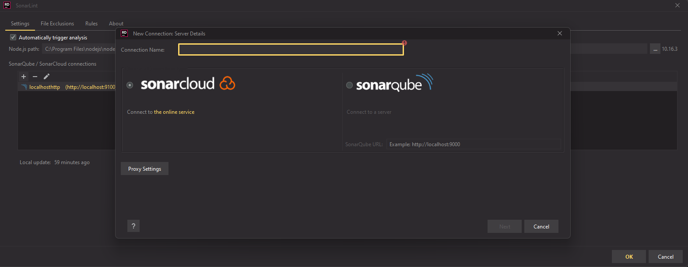

+++
author = "Thiago Borba"
title = "Sonarlint"
slug = "sonarlint"
date = "2022-04-21"
unsafe = true 
description = "O sonarlint é um plugin que faz análise estática de código, direto na IDE. Além de aumentar a qualidade do código é uma excelente fonte de conhecimento da linguagem analisada."
tags = [
"Dica",
"Coding",
]
categories = [
"coding",
]
image = "photo-1634128221889-82ed6efebfc3.jpg"

+++

## Sonarlint

O sonarlint é uma extensão free e opensource para as principais IDEs do mercado que ajuda a corrigir bugs no código, aumentar a qualidade e detectar falhas de segurança. O Sonarlint faz a análise estática do código, seja de um único arquivo ou de toda uma solução. 

<video autoplay loop muted playsinline src="index.assets/index-video.mp4" width="100%" height="100%"></video>

O Sonarlint entrega algumas centenas de regras específicas para cada tipo de linguagem suportada. Essas regras detectam bugs, code smell e vunerabilidades que podem ser introduzidas em tempo de codificação. O feedback é instantâneo!

## Conexão com SonarQube ou SonarCloud

O Sonarlint pode ser conectado a instâncias do SonarQube ou SonarCloud. Essa configuração permite receber as notificações de quality gates diretamente na IDE. Essa conexão também importa as regras de quality gates definidas no SonarQube/SonarCloud do projeto e/ou de uma linguagem, ou seja, após a conexão as regras passagem a ser analisadas diratemente na IDE. Além do aumenta da qualidade de código e conhecimento, ambos citados acima, **essa integração permite ter o feedback do quality gate sem a necessidade da análise da esteira de integração contínua**.

## Links e referências
| Ferramenta                       | Referência                                                   |
| -------------------------------- | ------------------------------------------------------------ |
| Sonarlint                        | https://www.sonarlint.org                                    |
| Extensão para Jetbrains          | https://plugins.jetbrains.com/plugin/7973-sonarlint#Jetbrains |
| Extensão para Visual Studio 2022 | https://marketplace.visualstudio.com/items?itemName=SonarSource.SonarLintforVisualStudio2022 |
| Extensão para Visual Studio 2019 | https://marketplace.visualstudio.com/items?itemName=SonarSource.SonarLintforVisualStudio2019 |
| Extensão para Visual Studio 2017 | https://marketplace.visualstudio.com/items?itemName=SonarSource.SonarLintforVisualStudio2017 |
| Extensão para Visual Studio Code | https://marketplace.visualstudio.com/items?itemName=SonarSource.sonarlint-vscode |
| Extensão para Eclipse            | https://marketplace.eclipse.org/content/sonarlint            |

