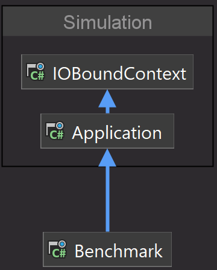

+++
author = "Thiago Borba"
title = "Comparando Task eliding e non-eliding"
slug = "task-eliding-vs-noneliding"
date = "2023-01-07"
description = "Eliding task é uma técnica de otimização que atrasa o unwrap de uma Task e reduz a alocação de memória. Faz sentido sempre utilizar essa técnica?"
tags = [
"Performance",
"C#",
]
categories = [
"LowLevel",
"csharp",
]
image = "martins-zemlickis-NPFu4GfFZ7E-unsplash.jpg"
+++

## Eliding Task
Por padrão, quando uma operação de IO Bound é executada, o await da task acontece no mesmo método que invocou a chamada. Em alguns cenários, após o await o resultado dessa task é retornado diretamente para o método que originou o fluxo. 
Um exemplo comum desse cenário é quando uma API com arquitetura em layers faz uma chamada ao banco de dados, passando por todas as camadas e retorna o valor da consulta em um response. 
A proposta do eliding task é que ao invés de fazer o await da task no mesmo método onde a task é iniciada, é que isso seja feito no método que originou o fluxo.

## Exemplo
No exemplo proposto nesse artigo, é feito uma resolução de IP para o domínio localhost, através de uma estrutura que representa um projeto n-layers.

Quando o await é feito sem eliding, ele ocorre na camada mais inferior.

```csharp
namespace IOBoundContext
{
    public class NetworkTools
    {
        public async Task<string> GetHostNameEntryAsync(string hostname)
        {
            var ipHostInfo = await Dns.GetHostEntryAsync(hostname);

            return ipHostInfo.AddressList[0].ToString();
        }

        public Task<IPHostEntry> ElidingGetHostNameEntryAsync(string hostname)
        {
            return Dns.GetHostEntryAsync(hostname);
        }
    }
}
```

Já no método que faz o eliding, ele retorna a task, sem fazer o await. Observe que a assinatura do método muda, perdendo o sufixo async.
O retorno também muda, retornando o objeto IPHostEntry e não mais uma string com o retorno tratado.

```csharp
public Task<IPHostEntry> ElidingGetHostNameEntryAsync(string hostname)
```

## Trade-offs
Como toda técnica de otimização, existem trade-offs entre **legibilidade** e **manutenibilidade** de código e performance.
A técnica de eliding otimiza alocação de memória. O impacto ocorre no stacktrace de expcetions * e responsabilidade única.

### Benefício: Alocação de memória
Para que uma chamada IO bound ocorra sem bloqueio de threads, é necessário que a chamada seja async-all-the-way, ou seja, do método chamador até a chamada de mais baixo nível na aplicação, 
devem ser chamadas marcadas como assíncronas.
No benchmark abaixo é possível observar a diferença na alocação de memória com a técnica. 


|         Method |              Runtime | Allocated native memory |   Gen0 | Allocated |
|--------------- |--------------------- |------------------------:|-------:|----------:|
| NonElidingTask | .NET Framework 4.7.2 |                       - | 0.4883 |    4532 B |
|    ElidingTask | .NET Framework 4.7.2 |                       - |      - |    2804 B |
|                |                      |                         |        |           |
| NonElidingTask |             .NET 6.0 |                11,192 B |      - |    1729 B |
|    ElidingTask |             .NET 6.0 |                11,192 B |      - |     897 B |

> O benchamark foi feito com .NET Framework 4.7.2 e .NET 6, onde é possível observar a evolução do framework.

### Trade-off 1: Stacktrace de exceptions
Como o await da task não acontece no método que iniciou a chamada assíncrona existe uma alteração na ordem do stracktrace de exceptions. Observe que a exception de uma task com eliding modifica o call stack. 

#### Exception no Eliding no .NET Framework 4.7.1
```csharp
Unhandled Exception: System.ArgumentNullException: Value cannot be null.
Parameter name: hostName
   at System.Net.Dns.HostResolutionBeginHelper(String hostName, Boolean justReturnParsedIp, Boolean flowContext, Boolean includeIPv6, Boolean throwOnIPAny, AsyncCallback requestCallback, Object state)
   at System.Net.Dns.BeginGetHostEntry(String hostNameOrAddress, AsyncCallback requestCallback, Object stateObject)
   at System.Threading.Tasks.TaskFactory`1.FromAsyncImpl[TArg1](Func`4 beginMethod, Func`2 endFunction, Action`1 endAction, TArg1 arg1, Object state, TaskCreationOptions creationOptions)
   at System.Net.Dns.GetHostEntryAsync(String hostNameOrAddress)
   at Benchmark.TaskNonElidingVsEliding.<ElidingTask>d__3.MoveNext() in D:\repos\c#\asyncawaiteliding\BenchmarkTaskEliding\Benchmark\Program.cs:line 91
--- End of stack trace from previous location where exception was thrown ---
   at System.Runtime.ExceptionServices.ExceptionDispatchInfo.Throw()
   at System.Runtime.CompilerServices.TaskAwaiter.HandleNonSuccessAndDebuggerNotification(Task task)
   at Benchmark.Program.ElidingTaskWithException() in D:\repos\c#\asyncawaiteliding\BenchmarkTaskEliding\Benchmark\Program.cs:line 38
   at Benchmark.Program.Main(String[] args) in D:\repos\c#\asyncawaiteliding\BenchmarkTaskEliding\Benchmark\Program.cs:line 25

```

Quando não é realizado o eliding, o call stack mostra todas as chamadas.
#### Exception sem Eliding no .NET Framework 4.7.1
```csharp
Unhandled Exception: System.ArgumentNullException: Value cannot be null.
Parameter name: hostName
   at System.Net.Dns.HostResolutionBeginHelper(String hostName, Boolean justReturnParsedIp, Boolean flowContext, Boolean includeIPv6, Boolean throwOnIPAny, AsyncCallback requestCallback, Object state)
   at System.Net.Dns.BeginGetHostEntry(String hostNameOrAddress, AsyncCallback requestCallback, Object stateObject)
   at System.Threading.Tasks.TaskFactory`1.FromAsyncImpl[TArg1](Func`4 beginMethod, Func`2 endFunction, Action`1 endAction, TArg1 arg1, Object state, TaskCreationOptions creationOptions)
   at System.Net.Dns.GetHostEntryAsync(String hostNameOrAddress)
   at IOBoundContext.NetworkTools.<GetHostNameEntryAsync>d__0.MoveNext() in D:\repos\c#\asyncawaiteliding\BenchmarkTaskEliding\Simulation\IOBoundContext\NetworkTools.cs:line 11
--- End of stack trace from previous location where exception was thrown ---
   at System.Runtime.ExceptionServices.ExceptionDispatchInfo.Throw()
   at System.Runtime.CompilerServices.TaskAwaiter.HandleNonSuccessAndDebuggerNotification(Task task)
   at Application.DoWork.<GetHostnameIpAddressAsync>d__0.MoveNext() in D:\repos\c#\asyncawaiteliding\BenchmarkTaskEliding\Simulation\Application\DoWork.cs:line 13
--- End of stack trace from previous location where exception was thrown ---
   at System.Runtime.ExceptionServices.ExceptionDispatchInfo.Throw()
   at System.Runtime.CompilerServices.TaskAwaiter.HandleNonSuccessAndDebuggerNotification(Task task)
   at Benchmark.TaskNonElidingVsEliding.<NonElidingTask>d__2.MoveNext() in D:\repos\c#\asyncawaiteliding\BenchmarkTaskEliding\Benchmark\Program.cs:line 83
--- End of stack trace from previous location where exception was thrown ---
   at System.Runtime.ExceptionServices.ExceptionDispatchInfo.Throw()
   at System.Runtime.CompilerServices.TaskAwaiter.HandleNonSuccessAndDebuggerNotification(Task task)
   at Benchmark.Program.NonElidingTaskWithException() in D:\repos\c#\asyncawaiteliding\BenchmarkTaskEliding\Benchmark\Program.cs:line 53
   at Benchmark.Program.Main(String[] args) in D:\repos\c#\asyncawaiteliding\BenchmarkTaskEliding\Benchmark\Program.cs:line 25
```

> **.NET 6 e task eliding**
>
> Durante o benchmark observei que essa issue foi tratada no .NET6, onde o call stack é exibido corretamente com a técnica do eliding.

##### Exception sem Eliding no .NET 6
```csharp
Unhandled exception. System.ArgumentNullException: Value cannot be null. (Parameter 'hostName')
   at System.Net.Dns.GetHostEntryOrAddressesCoreAsync(String hostName, Boolean justReturnParsedIp, Boolean throwOnIIPAny, Boolean justAddresses, AddressFamily family, CancellationToken cancellationToken)
   at System.Net.Dns.GetHostEntryAsync(String hostNameOrAddress, AddressFamily family, CancellationToken cancellationToken)
   at System.Net.Dns.GetHostEntryAsync(String hostNameOrAddress)
   at IOBoundContext.NetworkTools.GetHostNameEntryAsync(String hostname) in D:\repos\c#\asyncawaiteliding\BenchmarkTaskEliding\Simulation\IOBoundContext\NetworkTools.cs:line 11
   at Application.DoWork.GetHostnameIpAddressAsync(String hostname) in D:\repos\c#\asyncawaiteliding\BenchmarkTaskEliding\Simulation\Application\DoWork.cs:line 13
   at Benchmark.TaskNonElidingVsEliding.NonElidingTask() in D:\repos\c#\asyncawaiteliding\BenchmarkTaskEliding\Benchmark\Program.cs:line 83
   at Benchmark.Program.NonElidingTaskWithException() in D:\repos\c#\asyncawaiteliding\BenchmarkTaskEliding\Benchmark\Program.cs:line 52
   at Benchmark.Program.Main(String[] args) in D:\repos\c#\asyncawaiteliding\BenchmarkTaskEliding\Benchmark\Program.cs:line 23
```

##### Exception com Eliding no .NET 6
```csharp
Unhandled exception. System.ArgumentNullException: Value cannot be null. (Parameter 'hostName')
   at System.Net.Dns.GetHostEntryOrAddressesCoreAsync(String hostName, Boolean justReturnParsedIp, Boolean throwOnIIPAny, Boolean justAddresses, AddressFamily family, CancellationToken cancellationToken)
   at System.Net.Dns.GetHostEntryAsync(String hostNameOrAddress, AddressFamily family, CancellationToken cancellationToken)
   at System.Net.Dns.GetHostEntryAsync(String hostNameOrAddress)
   at IOBoundContext.NetworkTools.ElidingGetHostNameEntryAsync(String hostname) in D:\repos\c#\asyncawaiteliding\BenchmarkTaskEliding\Simulation\IOBoundContext\NetworkTools.cs:line 18
   at Application.DoWork.ElidingGetHostnameIpAddressAsync(String hostname) in D:\repos\c#\asyncawaiteliding\BenchmarkTaskEliding\Simulation\Application\DoWork.cs:line 20
   at Benchmark.TaskNonElidingVsEliding.ElidingTask() in D:\repos\c#\asyncawaiteliding\BenchmarkTaskEliding\Benchmark\Program.cs:line 92
   at Benchmark.Program.ElidingTaskWithException() in D:\repos\c#\asyncawaiteliding\BenchmarkTaskEliding\Benchmark\Program.cs:line 37
   at Benchmark.Program.Main(String[] args) in D:\repos\c#\asyncawaiteliding\BenchmarkTaskEliding\Benchmark\Program.cs:line 21
```

### Trade-off 2: Responsabilidade única
Quando o eliding acontece, a task é retornada sem unwrap, ou seja, ela retorna o objeto do nível mais baixo, sem tratamento. Esse comportamento, transfere a responsabilidade do tratamento do retorno para o método chamador, ou seja, o retorno é tratado em uma camada diferente de onde ele foi gerado. Em uma aplicação enterprise, isso significa que aplicação de uma regra de negócio no retorno poderia ser movida para uma outra camada (ex: camada de apresentação). Além disso, objetos de infraestrutura (ex.: IPHostEntry) passam a ser referenciados em mais de uma camada ou até mesmo em camadas fora do seu contexto.

#### Tratamento do retorno na camada chamadora
```csharp
namespace IOBoundContext
{
    public class NetworkTools
    {
        public async Task<string> GetHostNameEntryAsync(string hostname)
        {
            var ipHostInfo = await Dns.GetHostEntryAsync(hostname);

            return ipHostInfo.AddressList[0].ToString();
        }

        public Task<IPHostEntry> ElidingGetHostNameEntryAsync(string hostname)
        {
            return Dns.GetHostEntryAsync(hostname);
        }
    }
}
```

#### Tratamento do retorno na camada de alto nível
```csharp
namespace Benchmark
{
    (...)

        [Benchmark]
        public async Task<string> NonElidingTask()
        {
            var app = new DoWork();
            var result = await app.GetHostnameIpAddressAsync(_hostname);

            return result;
        }

        [Benchmark]
        public async Task<string> ElidingTask()
        {
            var app = new DoWork();
            var result = await app.ElidingGetHostnameIpAddressAsync(_hostname);

            return result.AddressList[0].ToString();
        }
    }
}
```

## Conclusão
Como toda técnica de otimização, existem trade-offs. O principal impacto da técnica de eliding task é a possível quebra de responsabilidades, com a transferência do tratamento do retorno para uma camada diferente da camada onde a chamada IO bound foi realizada. Antes de utilizar essa técnica, é essencial que sejam feitas medições e exista evidências que justifiquem o seu uso.

> 👉 Dica ☠️
> 
> Se não tiver medições e evidências que justifiquem o uso do eliding task, não use :)

> 🤯 **Informação**
> 
> Repositório: https://github.com/thgbrb/eliding-tasks