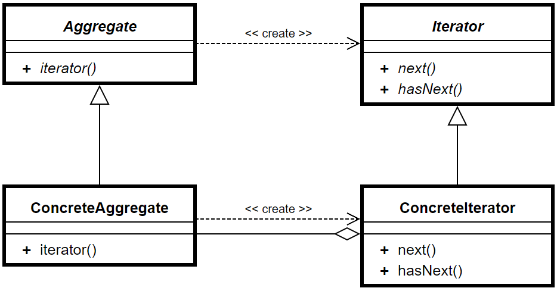
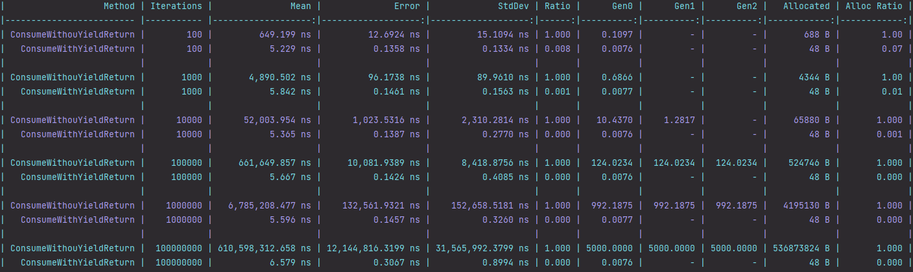

+++
author = "Thiago Borba"
title = "Uso otimizado de Enumerables com yield return"
slug = "yield-return"
date = "2023-02-05"
unsafe = true 
description = "Manipular listas é algo trivial no dia a dia do desenvolvimento. Existem casos em que são feitos filtros em uma grande quantidade de dados, o que pode ocasionar pressão no GC. Quando a lista possui pouco elementos é complexo detectar um possível problema, porém quando essa lista cresce, a dívida é cobrada. Uma forma de minimizar essa pressão é utilizando yield return."
tags = [
"Coding",
]
categories = [
"coding",
]
image = "kelly-sikkema-M6dAnUgiOlQ-unsplash.jpg"

+++

## Yield return
Dado uma lista de n elementos, o yield return retorna o próximo valor da sequência. O yield return trabalha no topo da interface IEnumerable, que é o contrato da implementação do iterator pattern na classe Enumerable. O iterator pattern é um padrão presente na maioria das linguagens de propósito geral e/ou orientada a objetos e é utilizado para atravessar uma coleção de objetos. Essa travessia permite desacoplar algoritmos da interação da lista.

Um objeto que herda de Agggregate agrega objetos. Esse objeto do tipo Aggregate é interado pelo objeto do tipo ConcreteIterator. 
<figure>
  
  <figcaption><strong>Fonte:</strong> https://en.wikipedia.org/wiki/Iterator_pattern#/media/File:Iterator_UML_class_diagram.svg</figcaption>
</figure>

## O problema com filtros
Um padrão típico na manipulação de listas é filtros de listas. No exemplo abaixo, recebemos uma lista de números onde os números pares são adicionados a uma nova lista e então são retornados.

```csharp
private IEnumerable<int> FilteringWithout(int iterations)
{
    var range = Enumerable.Range(1, iterations);
    var evenList = new List<int>();

    foreach (var number in range)
    {
        if (number % 2 == 0)
            evenList.Add(number);
    }

    return evenList;
}
```

O código está correto e funciona. Se essa lista for pequena, é provável que não cause pressão no GC, porém, quando a quantidade de objetos aumenta as coisas ficam interessantes.

## Usando o Yield return
O exemplo abaixo demonstra o yield return na prática. Como diz a sua definição, ele retorna o próximo elemento da lista. Uma vez que ele sempre retorna o próximo elemento da lista, não é necessário fazer as alocações de memória que observamos na solução anterior, onde cada objeto do resultado é adicionado a uma lista temporária que é retornada. 
Essa mudança de comportamento causa um impacto tremendo de pressão no GC.

```csharp
private IEnumerable<int> FilterWith(int iterations)
{
    var range = Enumerable.Range(1, iterations);

    foreach (var number in range)
    {
        if (number % 2 == 0)
            yield return number;
    }
}
```

### Benchmark com yield return
Os exemplos acima foram executados com o BenchmarkDotNet, onde é possível observar o efeito da pressão no GC no incremento da lista.
A partir da de 10_000 interações é observado a promoção de objetos para a GEN1. Quando a coleção é incrementada para 100_000 as coisas ficam mais interessantes. Nesse cenário é observado a promoção dos objetos para GEN2. Em um cenário real isso aumenta a chance de uma coleta full do GC. Interessante observar também que com a utilização do yield return a alocação de memória não muda no incremento da lista. Isso porque o interador retorna um objeto por vez ao invés de acumulá-los em uma lista temporária. A alocação de memória no cenário sem yield return e com 100_000_000 de interações é de 536MB.




## Cenários reais
Um cenário muito comum de encontrar pressão no GC por interações de coleções são em processos que manipulam arquivos de dados, tais como csv ou txt. As implementações mais comuns tratam cada linha do arquivo como um objeto em uma lista. O arquivo é lido, as linhas criam objetos que são adicionados em uma lista. Posteriormente são aplicadas manipulações que podem gerar outras listas intermediárias. A utilização do yield return na importação de arquivos habilita a leitura de blocos de linhas que são manipulados ao serem recebidos.

## Conclusão
A manipulação de coleções faz parte do dia a dia do desenvolvedor e merece muita atenção. É essencial considerar o volume de objetos que serão manipulados, isso pode se transformar em um ofensor. Sempre que possível utilize yield return nos retornos para aliviar a pressão no GC. Pequenas mudanças no estilo de codificação podem evitar ofensores, economizar recursos computacionais e entregar uma aplicação mais performática.

> Fontes: https://github.com/thgbrb/yield-return